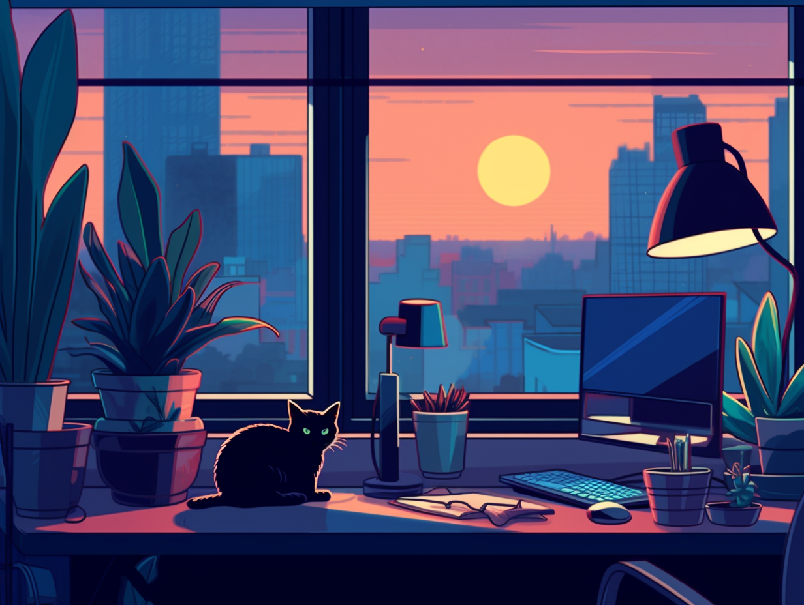

## Ciao! Sono TheCodeCat

Sono uno sviluppatore con un'esperienza di oltre 15 anni in questo mondo.

Ho visto l'evoluzione del software, dai tempi del VB6 fino alle ultime tecnologie come il framework .NET. 

Ho lavorato su vari progetti, dai programmi desktop alle librerie, applicazioni web e altro ancora.

Essendo nato a fine degli anni '80, ho vissuto la trasformazione del settore tecnologico e continuo ad abbracciare nuove sfide. 

Quando non sono impegnato a programmare, mi piace esplorare il mondo della filosofia, psicologia e intelligenza artificiale. In particolare, sono affascinato dall'arte generativa e dalla creazione di opere d'arte con l'IA.

## Perché il blog di TheCodeCat?

L'idea del blog è nata grazie ad altri scrittori tech su Twitter, ma soprattutto dal desiderio di esprimermi e far crescere la mia attività. Volevo uno spazio dove poter condividere la mia passione per la programmazione, C#, Azure, Docker, Kubernetes, il cloud computing e l'arte generativa.

## Contatti

Puoi contattarmi via email all'indirizzo [thecodecat23@gmail.com](mailto:thecodecat23@gmail.com) per domande o feedback.

Seguimi su Twitter [@thecodecat23](https://twitter.com/thecodecat23) per rimanere aggiornato su tecnologia, programmazione e altro ancora.

Dai un'occhiata alla mia pagina Facebook, [TheCodeCat](https://www.facebook.com/profile.php?id=100090223107344), per restare connesso e unirti alla community di appassionati di tecnologia.

E per tutto ciò che riguarda il codice, seguimi su [GitHub](https://github.com/thecodecat23).

